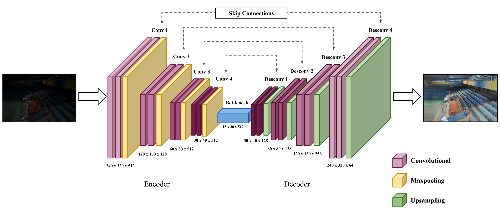

[](https://sol.sbc.org.br/index.php/sbrlars/article/view/39242)

# Autoencoder-based Low-Light Image Enhancer

<p align="center">
  
</p>

---

## Quick Start

### Clone the Repository

```powershell
git clone https://github.com/WillSever/ALLIE.git
cd ALLIE
```

### Create the Environment

```powershell
conda create -n allie python=3.10 -y
conda activate allie
```

### Install Dependencies

```powershell
conda install -c conda-forge cudatoolkit=11.2 cudnn=8.1.0 -y
python -m pip install --upgrade pip
python -m pip install -r requirements-win-gpu-tf210.txt
```

### Verify GPU Availability

```powershell
python scripts\check_tf_gpu.py
```

Expected output:

```text
GPU is available.
```

## Repository Layout

```text
ALLIE/
|-- configs/
|   |-- allie_base.yaml
|   `-- allie_384x256.yaml
|-- src/
|   `-- allie/
|-- scripts/
|   |-- train_tf.py
|   |-- infer_tf.py
|   |-- evaluate_tf.py
|   `-- check_tf_gpu.py
|-- data/
|-- checkpoints/
|   |-- allie_base.h5
|   `-- allie_384x256.h5
|-- results/
|-- docs/
`-- requirements-win-gpu-tf210.txt
```

## Available Checkpoints

| Model              | Resolution | Checkpoint                     |
| ------------------ | ---------- | ------------------------------ |
| ALLIE Base         | 320×240    | `checkpoints/allie_base.h5`    |
| ALLIE Aspect Ratio | 384×256    | `checkpoints/allie_384x256.h5` |

## Dataset Layout

The default configuration expects:

```text
data/
`-- Real_captured/
    |-- Train/
    |   |-- Low/
    |   `-- Normal/
    `-- Test/
        |-- Low/
        `-- Normal/
```

* `Low` images are the model inputs.
* `Normal` images are the reference targets.
* Datasets are not tracked by Git and must be provided locally.

## Run Inference

### Base Configuration

```powershell
python scripts\infer_tf.py --config configs\allie_base.yaml
```

Outputs:

```text
results/predictions/
results/comparisons/
```

### Aspect-Ratio Preserving Configuration

```powershell
python scripts\infer_tf.py --config configs\allie_384x256.yaml
```

Outputs:

```text
results/predictions_384x256/
results/comparisons_384x256/
```

## Train the Model

```powershell
python scripts\train_tf.py --config configs\allie_base.yaml --require-gpu
```

The best validation model is saved to:

```text
checkpoints/allie_base.h5
```

## Optional Evaluation

```powershell
python scripts\evaluate_tf.py --config configs\allie_base.yaml
```

This generates local PSNR and SSIM evaluation files.

## Documentation

Additional details are available in:

* `docs/windows_gpu_setup.md`
* `docs/paper_traceability.md`
* `docs/reproducibility_notes.md`

## Citation

If you use this repository in your research, please cite:

```bibtex
@inproceedings{rodrigues2025allie,
  author    = {Gabrielly Rodrigues and João Cavalcanti and José Pio and Felipe Oliveira},
  title     = {ALLIE: Autoencoder-based Low-Light Image Enhancement},
  booktitle = {Anais do XVII Simpósio Brasileiro de Robótica e XVI Workshop de Robótica na Educação},
  location  = {Vitória, ES, Brazil},
  year      = {2025},
  pages      = {249--254},
  publisher = {SBC},
  address   = {Porto Alegre, RS, Brazil},
  url       = {https://sol.sbc.org.br/index.php/sbrlars/article/view/39242}
}
```

